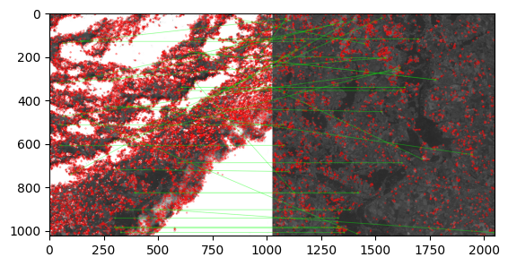
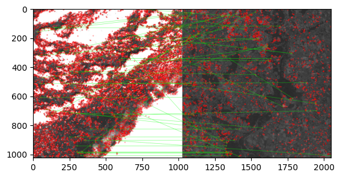
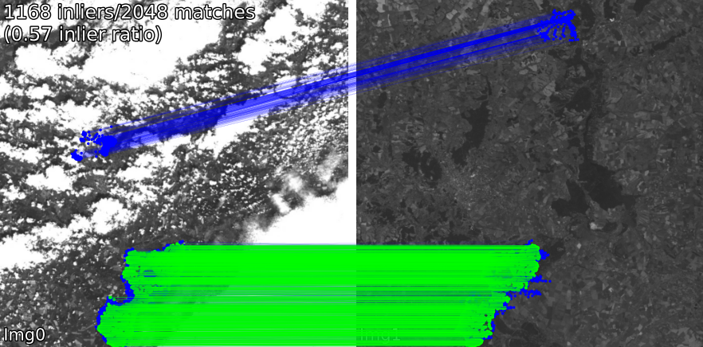
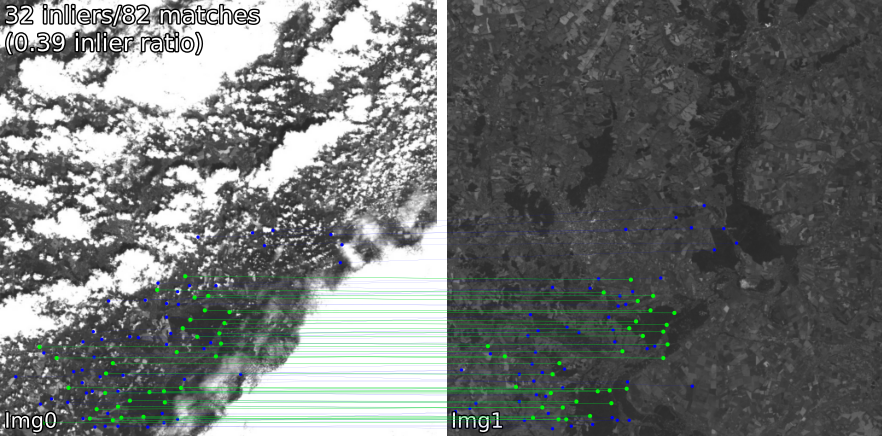
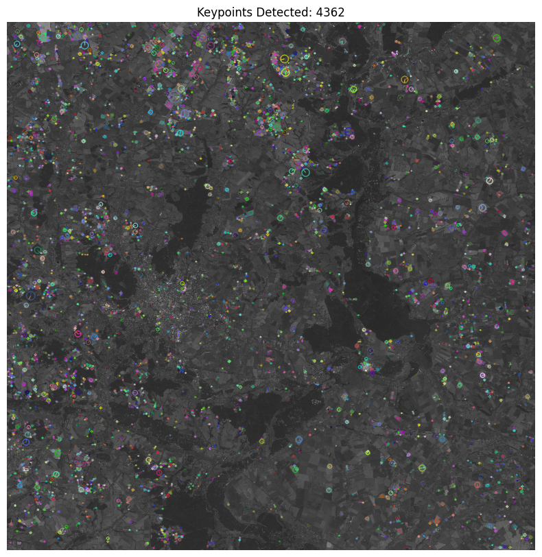
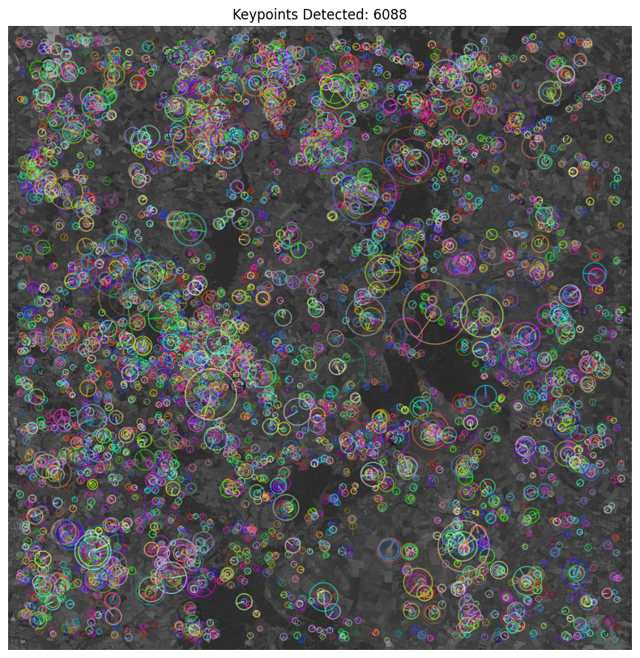
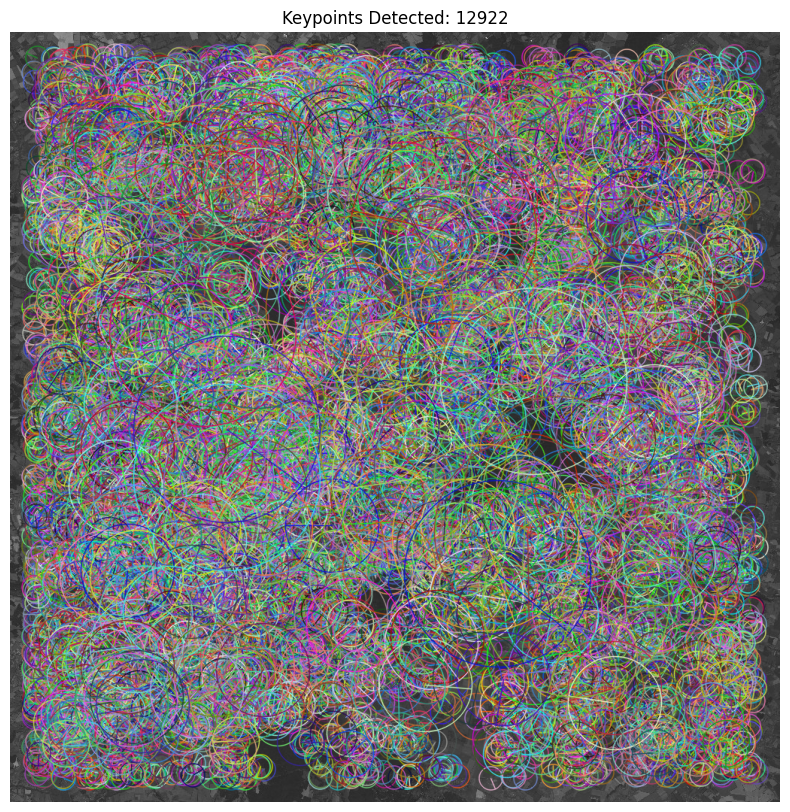

# Sentinel2ImageMatching
This project focuses on developing an algorithm to match and align Sentinel-2 satellite images
## Matching Examples

**SIFT-Brute-Force:**  


**SIFT-FLANN:**  


**RoMa:**  


**Superglue:**  



## Extraction Examples
**SIFT:**  


**BRISK:**  


**ORB:**  


## Structure
- **algorithm.py**: Contains the core functionality for keypoint detection and image matching.
- **demo.ipynb**: A Jupyter notebook demonstrating the image matching algorithm in practice.
- **data**: Stores preprocessed satellite images from the [Deforestation in Ukraine dataset](https://www.kaggle.com/datasets/isaienkov/deforestation-in-ukraine).
- **matches**: Holds examples of matched image pairs.


## Setup Environment

To set up the environment, run the following commands:

```bash
pip install --upgrade pip setuptools wheel
pip install -r requirements.txt
pip install .
